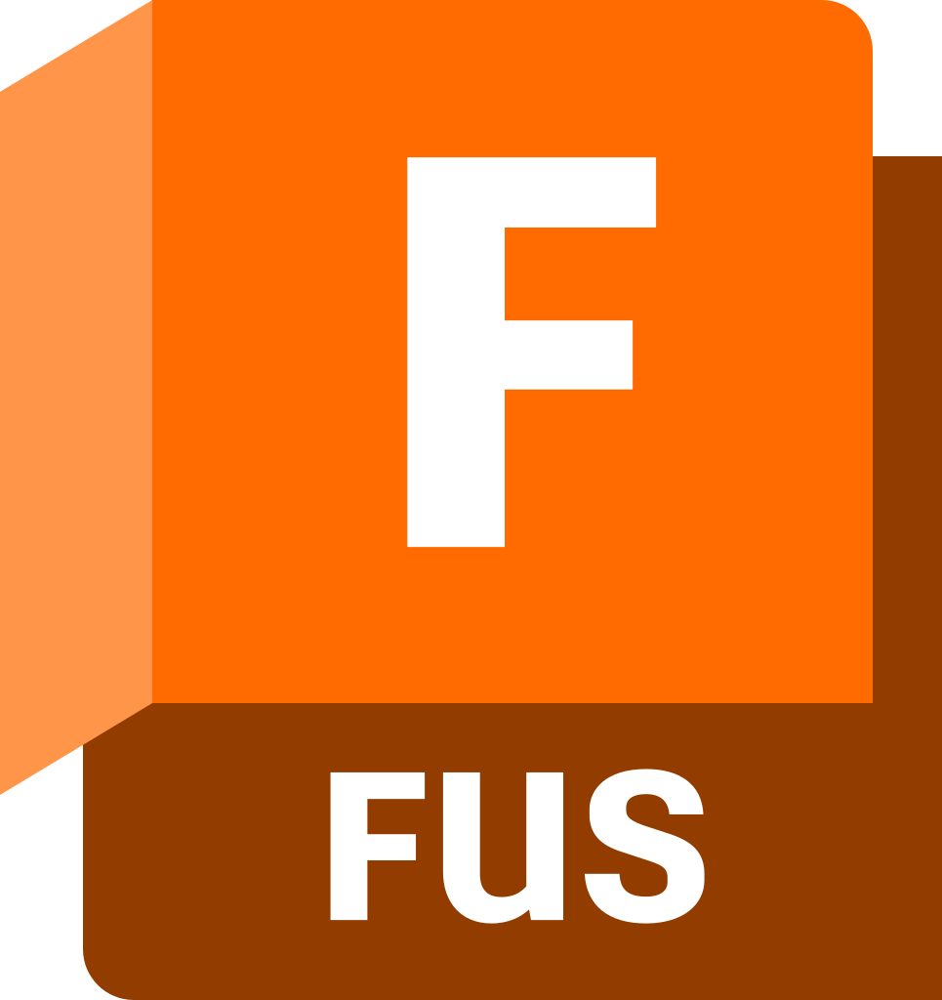

<!-- markdownlint-disable MD033 -->
<!-- markdownlint-disable MD045 -->
<h1 align="center">
  
  Hi there, I'm MaestroFusion360
</h1>

<h3 align="center">
  CNC Software Engineer | Fusion 360 Developer | Automation Specialist
</h3>

  
  

---

## 🚀 About Me

I'm a CNC/CAM engineer and software developer working with Fusion 360, postprocessors and real-world machining workflows. I build automation tools, G-code utilities and web apps, and I also develop my own UI libraries on Svelte 5 with a clean, minimal architecture. My work spans from postprocessor customization and CAM process tuning to full-stack platforms with PWA frontends, bots and engineering analytics. I focus on clarity, predictable behavior and tools that actually help engineers get work done faster and with fewer errors.

**Core Focus Areas:**

- **Fusion 360 Add-In Development** (Python/JavaScript)
- **Post Processor Customization & CAM Automation**
- **CNC Workflow Optimization**
- **Excel VBA Integration for Manufacturing Data**
- **Aiogram Bots**
- **Web applications & UI (Svelte 5, TypeScript, Tailwind)**

---

## 🛠️ Primary Tools

  
  
  
  
  
  
  
  
  
  
  
  
  

---

## 📊 GitHub Stats

  
  

  

